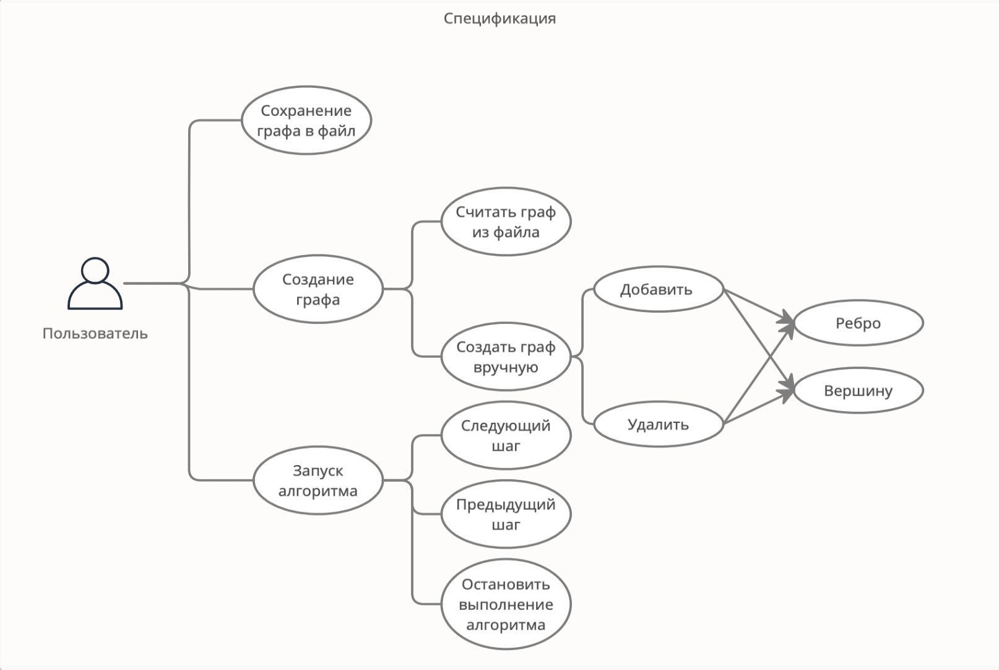

# Спецификация 


**Цель:** Разработать программу с графическим интерфейсом на языке программирования Java для визуализации работы алгоритма Дейкстры.


**Суть Алгоритма:** Алгоритм находит кратчайшие пути от одной из вершин графа до всех остальных.

**Описание Алгоритма:** 

В начале алгоритма расстояние для начальной вершины полагается равным нулю, а все остальные расстояния заполняются большим положительным числом (бо́льшим максимального возможного пути в графе). Массив флагов заполняется нулями. Затем запускается основной цикл.

На каждом шаге цикла мы ищем вершину *v* с минимальным расстоянием и флагом равным нулю. Затем мы устанавливаем в ней флаг в 1 и проверяем все соседние с ней вершины *u*. Если в них (в *u*) расстояние больше, чем сумма расстояния до текущей вершины и длины ребра, то уменьшаем его. Цикл завершается, когда флаги всех вершин становятся равны 1, либо когда у всех вершин c флагом 0 *d[i] = \infty*. Последний случай возможен тогда и только тогда, когда граф G несвязный.


**Псевдокод:**

```
func dijkstra(s):
    for v ∈ V                    
        d[v] = ∞
        used[v] = false
    d[s] = 0
    for i ∈ V
        v = null
        for j ∈ V   // найдём вершину с минимальным расстоянием
            if !used[j] and (v == null or d[j] < d[v])
                v = j
        if d[v] == ∞
            break
        used[v] = true
        for e : исходящие из v рёбра     // произведём релаксацию по всем рёбрам, исходящим из v
            if d[v] + e.len < d[e.to]
                d[e.to] = d[v] + e.len
```

**UML-диаграмма, демонстрирующая возвожности приложения**

